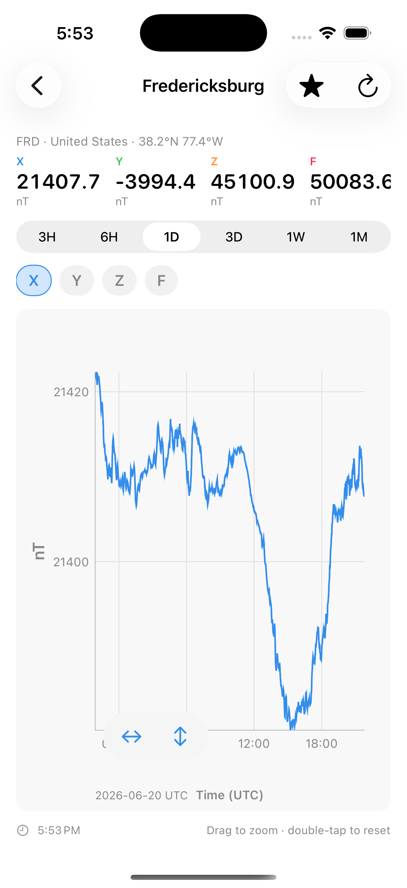

# Observatory

Observatory is a cross-platform Apple app (iOS, iPadOS, macOS, watchOS) for viewing
[INTERMAGNET](https://intermagnet.org) geomagnetic observatory data. It fetches one-minute
field measurements from the Edinburgh Geomagnetic Information Node (GIN), caches them, and
plots them with an interactive, zoomable time-series chart. It ships with home-screen and
lock-screen **widgets**, a **watchOS app**, and watch **complications**.

The plotting engine (Canvas line renderer, pan/zoom/drag-zoom interaction, nice-number and
time axes) is reused from the [HiDeF](../hidef) HDF5 viewer; all of the HDF5 machinery has
been removed and replaced with an INTERMAGNET data layer.

<p>
  
</p>

## What it does

- **Browse observatories** — a searchable directory of INTERMAGNET stations with favorites.
- **Plot the field** — X/Y/Z/H/D/F/G components on an interactive time axis shown in your
  local time zone (the data itself is UTC). Pinch or
  drag to zoom, double-tap to reset, pan with two fingers / scroll.
- **Pick a window** — 3H / 6H / 1D / 3D / 1W / 1M, each fetched on demand.
- **Spot storms** — sections where the field changes by ≥50 nT within 30 minutes are flagged
  on the compact charts and labelled *Moderate* (50–100 nT), *Intense* (100–250 nT), or
  *Super* (>250 nT), highlighted yellow/orange/red. Detection runs on full-resolution
  minute data ([`StormDetector`](Sources/ObservatoryCore/StormDetector.swift)).
- **Glance** — a set of widgets and complications for the observatory you last viewed, all
  driven by one shared, cache-first timeline provider:
  - **Widgets** (iOS/macOS): *Field Reading* (value + sparkline; also lock-screen
    rectangular/circular/inline), *Field Chart* (sparkline-dominant), and *All Components*
    (current X/Y/Z/F grid, medium/large).
  - **Complications** (watch): *Field Reading* (circular / inline / corner) and *Field
    Chart* (rectangular — the full app chart style: hour grid, deviation axis, dot, dashed
    reference line, and storm bands).

  Surfaces lead with **F** (total field), falling back through H/X/… for observatories that
  don't report it.

## Fetching & caching strategy

The two hard requirements — *only fetch data that matches the view* and *only fetch data
that is new* — are met by treating the **UTC day** as the unit of work and caching:

- A view is `(observatory, time window)`. The repository asks for exactly the UTC days that
  window spans — nothing more.
- Each day is cached on disk (one binary-plist file per `observatory/yyyy-mm-dd`) in the
  shared App Group container, so the app, widgets, and watch all read the same cache.
- A day strictly **before today is immutable** once cached and is never re-fetched. Today
  (and any not-yet-finalized recent day) is re-fetched only after a short staleness window,
  so panning and zooming within the loaded range costs nothing.
- Missing days are coalesced into contiguous runs and fetched with a **single GIN request**
  each (`dataDuration`), then split back into per-day cache entries.
- Data is decimated with a **min/max envelope** to the plot's point budget, which preserves
  storm spikes that averaging would smooth away.

See [`GeomagRepository`](Sources/ObservatoryCore/GeomagRepository.swift).

## Data source

By default the app talks to the **Observatory mirror** — a Cloudflare Worker (the
`observatory-worker` repo) that caches INTERMAGNET data and rate-limits upstream access so
the whole app fleet never hammers the GIN directly. The mirror is a drop-in: it accepts the
same `GetData` request and returns identical IAGA-2002 text, so the parser/cache/decimation
below are unchanged. Set the `OBSERVATORY_BASE_URL` environment variable (in the Xcode
scheme) to bypass it and hit the GIN — or a local `wrangler dev` — directly. See
[`GINClient`](Sources/ObservatoryCore/GINClient.swift).

The underlying request mirrors the official INTERMAGNET `download.py` reference, e.g.:

```
https://imag-data.bgs.ac.uk/GIN_V1/GINServices?Request=GetData&format=IAGA2002
  &observatoryIagaCode=FRD&samplesPerDay=1440&orientation=Native
  &publicationState=adj-or-rep&recordTermination=UNIX
  &dataStartDate=2026-06-21&dataDuration=1
```

`publicationState=adj-or-rep` returns the best available data (definitive → adjusted →
reported → provisional), so recent days — including today — are covered. Responses are
[IAGA-2002](Sources/ObservatoryCore/IAGA2002Parser.swift) text; `99999`/`88888` sentinels
become gaps.

Per the INTERMAGNET license, geomagnetic data is for non-commercial use; acknowledge the
operators and INTERMAGNET when publishing. See https://intermagnet.org.

## Project layout

```
Sources/
  ObservatoryCore/        Shared data layer (no UI)
    IAGA2002Parser, GINClient, GeomagStore (cache), GeomagRepository (fetch-only-missing),
    models, observatory directory, shared selection state, UTC date math
  ObservatoryPlot/        Shared plotting (ported from HiDeF) + widget rendering
    ObsLinePlotView (interactive), ObsSparkline, time/numeric axes, GeomagWidgetView
  Observatory/            iOS + macOS app
  ObservatoryWidgets/     iOS + macOS WidgetKit extension
  ObservatoryWatch/       watchOS app
  ObservatoryWatchWidgets/ watchOS complications (WidgetKit)
Resources/                Entitlements, extension Info.plists, asset catalogs
Scripts/                  Build helper (all-platform xcodebuild sweep)
```

All targets compile `ObservatoryCore` + `ObservatoryPlot` directly (no embedded framework).

## Building

`Geomagnetic.xcodeproj` is the source of truth, managed in Xcode. Open it and run the
**Observatory** or **ObservatoryWatch** scheme; there are no external dependencies, and the
embedded targets (widgets, the watch companion) build automatically.

When adding a new Swift file, tick its Target Membership for **all four targets** — the
shared `ObservatoryCore`/`ObservatoryPlot` sources compile into every target rather than
being linked as a framework.

To build every platform from the command line (identical to Xcode's Build):

```sh
./Scripts/build-all.sh                    # macOS, iOS simulator, watchOS simulator
```

Command line, single platform:

```sh
xcodebuild -project Geomagnetic.xcodeproj -scheme Observatory \
  -destination 'platform=macOS' build
xcodebuild -project Geomagnetic.xcodeproj -scheme Observatory \
  -destination 'platform=iOS Simulator,name=iPhone 17 Pro' build
xcodebuild -project Geomagnetic.xcodeproj -scheme ObservatoryWatch \
  -destination 'platform=watchOS Simulator,name=Apple Watch Series 11 (46mm)' build
```

### Signing & App Group

To run on device (and for widgets/watch to share the cache with the app), set your
`DEVELOPMENT_TEAM` and provision the App Group `group.com.twarge.observatory` on every
target. Without a working App Group the app still runs — each process just falls back to its
own Application Support directory instead of the shared cache.

Targets / bundle IDs:

| Target | Platforms | Bundle ID |
| --- | --- | --- |
| Observatory | iOS, macOS | `com.twarge.observatory` |
| ObservatoryWidgets | iOS, macOS | `com.twarge.observatory.widgets` |
| ObservatoryWatch | watchOS | `com.twarge.observatory.watch` |
| ObservatoryWatchWidgets | watchOS | `com.twarge.observatory.watch.widgets` |

The watch app is standalone. To distribute it inside the iOS app on the App Store, add an
"Embed Watch Content" copy-files phase from the iOS app to the watch app and set the watch
app's `WKCompanionAppBundleIdentifier`.

## License

Apache-2.0. Derived in part from HiDeF (© Twarge LLC). Geomagnetic data © the respective
observatory operators / INTERMAGNET.
